# GitHub Actions Auto-Deployment Setup

This repository is configured with GitHub Actions to automatically deploy your LiveKit MCP Agent whenever you push changes to the main branch.

## 🔧 Required GitHub Secrets

To enable auto-deployment, you need to configure the following secrets in your GitHub repository:

### Go to: `Settings` → `Secrets and variables` → `Actions` → `New repository secret`

### Required Secrets:

| Secret Name | Description | Example Value |
|-------------|-------------|---------------|
| `LIVEKIT_URL` | Your LiveKit Cloud URL | `wss://ttd-admin-o7dh273v.livekit.cloud` |
| `LIVEKIT_API_KEY` | LiveKit API Key | `APIDLKe9KFnAs4m` |
| `LIVEKIT_API_SECRET` | LiveKit API Secret | `EybXGdIiKzWGJY8mneZezoMR7FjfLxjVmKsXRRXI0DLB` |
| `MC3_API_KEY` | MC3 Server API Key | `Bearer sk_mt_PQN6W7St9GTh4ontUQptDzy4Ot5LQmf2b6V8ZBNrtHl2vmUCZSC4pkwk5Rr1Oybc` |
| `OPENAI_API_KEY` | OpenAI API Key | `sk-proj-...` |
| `DEEPGRAM_API_KEY` | Deepgram API Key | `ddb9ee2b7a152c9b9c87fd77c6958f33db430697` |
| `CARTESIA_API_KEY` | Cartesia API Key | `sk_car_9fM7KFZEfqeEfiETkHXwaH` |

### Optional Secrets:

| Secret Name | Description | When to Use |
|-------------|-------------|-------------|
| `RUBE_API_KEY` | Rube API Key (backup) | If you want to keep the old Rube connection |
| `RAILWAY_TOKEN` | Railway deployment token | For alternative deployment method |

## 🚀 How Auto-Deployment Works

### Triggers:
- **Push to main/master branch**: Automatically deploys when you push changes
- **Pull Request merge**: Deploys when a PR is merged to main
- **Manual trigger**: You can manually trigger deployment from GitHub Actions tab

### Workflow Steps:
1. **Test Connection**: Verifies MC3 MCP server connection
2. **Validate Configuration**: Checks all required environment variables
3. **Deploy Agent**: Attempts deployment via LiveKit CLI or alternative methods
4. **Notify Status**: Reports success/failure status

### Files that Trigger Deployment:
- `agent.py` - Main agent code
- `requirements.txt` - Dependencies
- `livekit.toml` - LiveKit configuration
- Any `.py` files - Python code changes
- Workflow file itself

## 📋 Setup Instructions

### 1. Add Secrets to GitHub

```bash
# Go to your GitHub repository
# Navigate to: Settings → Secrets and variables → Actions
# Click "New repository secret" for each required secret
```

### 2. Test the Workflow

```bash
# Make a small change and push to trigger deployment
echo "# Test auto-deployment" >> README.md
git add README.md
git commit -m "test: trigger auto-deployment"
git push origin main
```

### 3. Monitor Deployment

- Go to the **Actions** tab in your GitHub repository
- Watch the deployment progress in real-time
- Check logs for any issues

## 🔍 Troubleshooting

### Common Issues:

#### ❌ "Missing environment variables"
- **Solution**: Ensure all required secrets are added to GitHub repository settings
- **Check**: Settings → Secrets and variables → Actions

#### ❌ "MC3 connection test failed"
- **Solution**: Verify your `MC3_API_KEY` is correct and has proper Bearer prefix
- **Check**: Test locally with `python test_mc3_connection.py`

#### ❌ "LiveKit CLI not found"
- **Solution**: The workflow will fall back to alternative deployment methods
- **Note**: This is expected and the deployment should still work

#### ❌ "Deployment failed"
- **Solution**: Check the deployment logs in GitHub Actions
- **Fallback**: Deploy manually using `python deploy_mc3_agent.py`

### Manual Deployment (Fallback):

If auto-deployment fails, you can still deploy manually:

```bash
# Local deployment
source venv/bin/activate
python agent.py dev

# Or use the deployment script
python deploy_mc3_agent.py
```

## 🎯 Workflow Features

### ✅ **Automatic Testing**
- Tests MC3 MCP server connection before deployment
- Validates all required environment variables
- Prevents broken deployments

### ✅ **Multiple Deployment Methods**
- Primary: LiveKit CLI (if available)
- Fallback: Railway deployment
- Backup: Manual deployment package

### ✅ **Smart Triggers**
- Only deploys on relevant file changes
- Supports manual triggering
- Works with pull request merges

### ✅ **Comprehensive Logging**
- Detailed deployment logs
- Success/failure notifications
- Artifact preservation for debugging

## 🔄 Deployment Flow

```mermaid
graph TD
    A[Push to main] --> B[GitHub Actions Triggered]
    B --> C[Test MC3 Connection]
    C --> D{Connection OK?}
    D -->|Yes| E[Validate Environment]
    D -->|No| F[❌ Fail with Error]
    E --> G{All Secrets Set?}
    G -->|Yes| H[Deploy Agent]
    G -->|No| F
    H --> I{Deployment Success?}
    I -->|Yes| J[✅ Agent Updated]
    I -->|No| K[Try Alternative Method]
    K --> L{Alternative Success?}
    L -->|Yes| J
    L -->|No| M[❌ Manual Deployment Needed]
```



## 📞 Support

If you encounter issues with auto-deployment:

1. **Check GitHub Actions logs** for detailed error messages
2. **Verify all secrets** are properly configured
3. **Test locally** with the same environment variables
4. **Use manual deployment** as a fallback option

---

🎉 **Once configured, your agent will automatically update whenever you push changes to the repository!**
